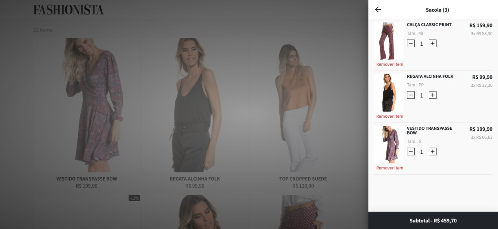

# Front-End do Hoshi App (Projeto Hackadev)

- Front-End Status: 
- Docs Status: 
- Back-End Status: 

- [Link para Frontend](https://hoshi-vite.netlify.app)
- [Link para Documentação do Frontend](https://hoshi-vite-docs.netlify.app)
- [Link para API](https://hoshi-api.herokuapp.com/)

## 1ª Etapa:

### Hackadev - 1° Fase

Prazo de entrega: 31/07/2022

#### O que é:

Projeto prático em grupo de longo prazo que vai simular ambiente das empresas.

#### Papel do Monitor:

Liderar equipe

#### Como vai funcionar:

Iremos criar desafios faseados de um mesmo projeto.

Ex:

1.  Criação de telas

2.  Criação de chat de atendimento

3.  Comunicação com banco de dados…

#### Objetivo

1.  Avaliar a capacidade de trabalho em equipe.

2.  Estimular Soft Skills.

3.  Auxiliar no desenvolvimento técnico.

4.  Possibilitar que monitores nos ajudem na avaliação dos alunos.

5.  Simular o ambiente das empresas.

#### Cenário

Segundo o levantamento, da Webshoppers (Ebit / Nielsen), os e-commerces brasileiros faturaram cerca de R$ 53,2 bilhões em 2018.

O segmento “Moda e Acessórios” representa 5,6% do faturamento no varejo online, ocupando a segunda posição entre as categorias de produtos com mais pedidos, perdendo apenas para o segmento de eletroeletrônicos.

Oferecer a melhor experiência aos usuários que interagem com os produtos no desktop, e principalmente em dispositivos móveis, é fundamental para se manter vivo e competitivo nesse segmento.

#### Regras

- [x] Deve-se implementar as telas utilizando HTML/CSS puro.
- [x] Deve implementar as funcionalidades apresentadas nos wireframes / layouts.
- [x] Deve ser mobile first, possuindo uma experiência satisfatória tanto em mobile quanto em desktop.
- [x] Utilize BEM CSS para escrever os estilos.
- [x] Deve-se fazer deploy do projeto, servindo-o no Netlify.
- [x] Não utilize frameworks CSS como Bootstrap, Foundation e afins.

#### Requisitos obrigatórios

- [x] Para cada item do catálogo de produtos as seguintes informações devem estar na página:
- - [x] Imagem
- - [x] Nome
- - [x] Preço
- - [x] Status “Em promoção”
- - [x] Preço promocional (se disponível)
- - [x] Tamanhos disponíveis
- - [x] Selo “Promoção”
- [x] Deve ser possível adicionar itens por tamanho no carrinho de compras.
- [x] Deve ser possível visualizar os itens adicionados no carrinho de compras, exibindo imagem, nome, preço e quantidade.
- [x] Deve ser possível remover itens do carrinho de compras.

#### Requisitos opcionais

- [x] O carrinho de compras deve persistir entre reloads de página.
- [x] Alguns produtos não tem todos os tamanhos disponíveis, mostre apenas os tamanhos disponíveis em estoque.
- [x] Implemente a funcionalidade de busca em tempo real.

#### Deploy

A recomendação é para que o deploy seja feito no [netlify](https://www.netlify.com) (gratuito) ou serviço similar.

#### Layouts

Os layouts abaixo servem de referência visual das funcionalidades, sintam-se livres para segui-las ou implementá-las com base em outras referências, desde que atenda às regras e aos requisitos obrigatórios.

##### Layouts: Home (catálogo)

##### Layouts: Página do produto

##### Layouts: Indicador de produtos no ícone do carrinho

##### Layouts: Carrinho de compras aberto

##### Layouts: Busca em tempo real

##### Layouts: Página de cadastro

##### Layouts: Página de checkout

## 2ª Etapa:

### Hackadev - 2° Fase

Prazo de entrega: 29/08/2022
Apresentação: 02/09/2022

#### Objetivo

1. Migrar o projeto para ReactJS.

2. Adicionar funcionalidades de adição/exclusão de produtos no carrinho.

#### Regras

- [x] Deve-se implementar as telas utilizando ReactJS.
- [x] Deve-se implementar apenas o Front-End da aplicação, não é para implementar Back-End.
- [x] Deve-se fazer deploy do projeto, servindo-o no Netlify ou Vercel.
- [x] Não utilize frameworks CSS como Bootstrap, Foundation e afins.

#### Requisitos obrigatórios

- [x] Deve ser possível adicionar itens por tamanho no carrinho de compras.
- [x] Deve ser possível visualizar os itens adicionados no carrinho de compras, exibindo imagem, nome, preço e quantidade.
- [x] Deve ser possível remover itens do carrinho de compras.

#### Deploy

A recomendação é para que o deploy seja feito no [netlify](https://www.netlify.com) (gratuito) ou serviço similar.

## 3ª Etapa:

### Hackadev - 3° Fase

Prazo de entrega: 03/10/2022

#### Objetivo

1.  Finalizar pedido salvando os dados do pedido no banco de dados.
2.  Notificar cliente que o pedido foi finalizado com sucesso via WhatsApp com Twilio.

#### Regras

- [x] Deve-se criar uma API em NodeJS.
- [x] Deve-se utilizar o banco de dados PostgreSQL.
- [x] Deve-se fazer deploy, servindo-o no Netlify, Heroku ou Vercel.

#### Requisitos obrigatórios

- [x] Deve ser possível finalizar o pedido e salvar todos os dados do pedido no banco de dados.

#### Requisitos opcionais

- [x] Notificar cliente que o pedido foi finalizado com sucesso via WhatsApp com Twilio.
- [x] Colocar na mensagem de notificação Nome do Cliente e N° do Pedido.

#### Twilio

[Documentação API Twilio WhatsApp - NodeJS](https://www.twilio.com/pt-br/docs/whatsapp/quickstart/node)

#### Deploy

A recomendação é para que o deploy seja feito no [netlify](https://www.netlify.com) (gratuito) ou serviço similar.

## 4ª Etapa:

### Produtos relacionados - Projeto Individual

Prazo de entrega: 01/11/2022

#### Objetivo

Quando o usuário entrar na página de um produto deve ter um componente para exibir alguns produtos relacionados a categoria daquele produto.

#### Regras

- [x] Clonar o projeto do Hackadev do seu grupo e fazer a partir dele.
- [x] A feature deverá ser implementada pelo aluno de forma individual.
- [x] Deve ser mobile first, possuindo uma experiência satisfatória tanto em mobile quanto em desktop.
- [x] Deve-se fazer deploy do projeto, servindo-o no Netlify ou serviço similar.
- [x] Ao finalizar o aluno deverá gravar um vídeo explicando de forma técnica como foi feito a implementação e disponibilizar o link do vídeo no envio do projeto.

#### Requisitos obrigatórios

- [x] Criar um componente para a seção e importar na página do produto.
- [x] Apresentar no mínimo 5 produtos relacionados.

#### Requisitos opcionais

- [x] Criar slide para apresentar os produtos relacionados.

#### Deploy

A recomendação é para que o deploy seja feito no [netlify](https://www.netlify.com) (gratuito) ou serviço similar.

#### Layouts

O layout abaixo serve de referência visual.

